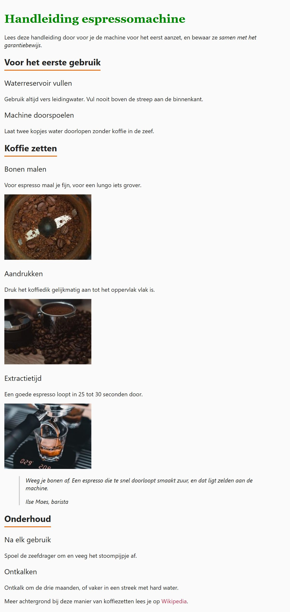

## Theorie

HTML heeft zes kopniveaus, `<h1>` tot en met `<h6>`. Elk niveau is een aparte tag, en dus ook een aparte tagselector: er bestaat geen selector die alle titels tegelijk pakt.

```css
h1 { /* selecteert enkel de h1 */
   text-transform: uppercase;
}

h2 { /* selecteert enkel de h2 */
   letter-spacing: 2px;
}
```

Wil je verschillende niveaus toch samen opmaken, dan groepeer je de selectoren met een komma. Dat komt verderop aan bod.

Een tagselector werkt trouwens voor élke tag, niet alleen voor titels. Ook een `blockquote` of een link spreek je op die manier aan.

## Opdracht

Selecteer de verschillende kopniveaus, en daarna nog een paar andere elementen.

1. Geef de &lt;h1&gt;-titel het lettertype Georgia met `font-family: Georgia, serif`, en maak hem grasgroen met `color: #080`.
2. Zet onder elke &lt;h2&gt;-titel een oranje lijn met `border-bottom: 3px solid #e87722`, en houd de tekst er wat van weg met `padding-bottom: 6px`. Beperk de lijn tot de breedte van de tekst met `width: fit-content`.
3. Stel de lettergrootte van alle &lt;h3&gt;-titels in met `font-size: 20px`, en het lettergewicht met `font-weight: 400`.
4. Geef de &lt;blockquote&gt; een grijze lijn links met `border-left: 3px solid #ccc` en `padding-left: 16px`, en zet de tekst schuin met `font-style: italic`.
5. Maak de links bruinrood met `color: #b35` en haal de onderlijning weg met `text-decoration: none`.

## Screenshot


