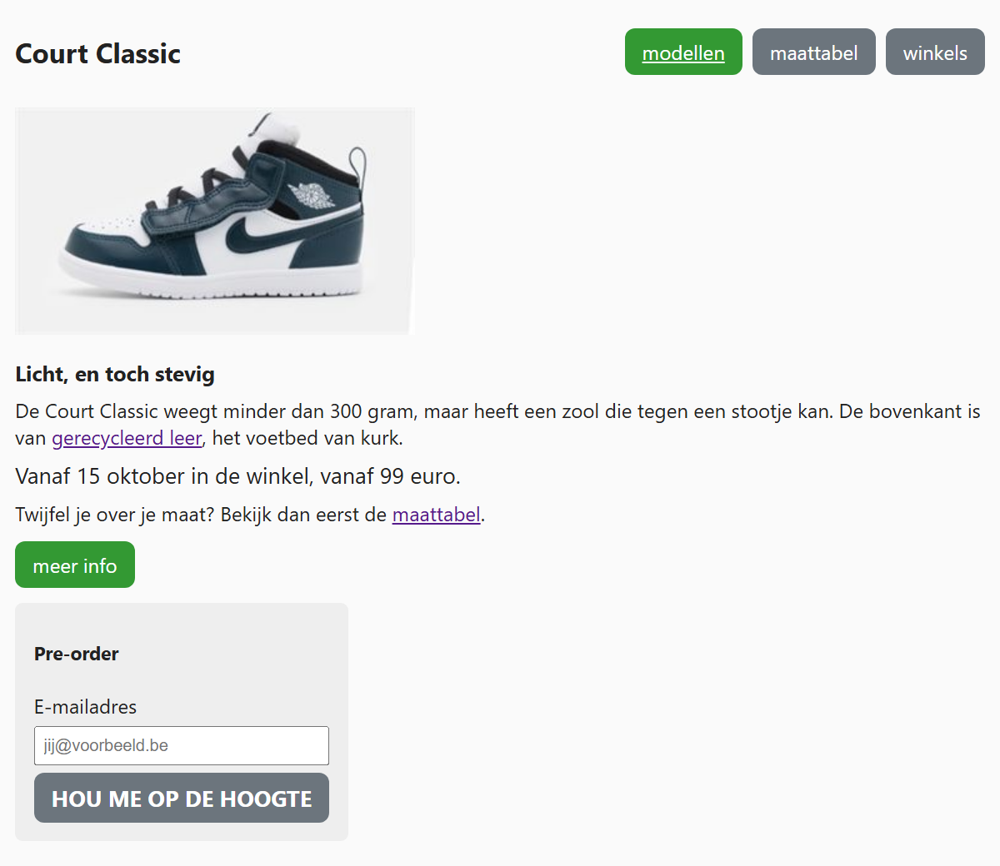

## Theorie

Neem deze twee klassen in CSS:

```css
.info { /* elk element met class "info" */
   background-color: #ff99;
   border: 1px solid #888;
}

.groter { /* elk element met class "groter" */
   font-size: 18px;
}
```

Je kan beiden toewijzen aan één element; de stijlen worden dan gecombineerd:

```html
<p class="info groter">deze paragraaf heeft twee classes</p> <!-- deze paragraaf heeft een info opmaak én is groter -->
```

Omgekeerd kan je ook stijlen toewijzen _enkel_ aan elementen die beiden klassen hebben (let op: **tegen elkaar**, zonder spatie!).

```css
.info.groter { /* enkel de elementen met class "info" én "groter" */
   color: #009;
}
```

Let op het verschil met `.info .groter` (mét spatie): dat selecteert een element met class `groter` binnen een element met class `info`.

## Opdracht

Op deze productpagina staat de class `button` op de drie menulinks, op de link "meer info" en op de knop van het formulier. De menulinks dragen daarnaast de class `menu-link`. De class `highlight` staat op de eerste menulink en op "meer info", de class `groter` op de knop van het formulier en op één paragraaf.

1. Geef alle elementen met class `button` deze opmaak, zodat de links en de knop er hetzelfde uitzien:
   - een grijze achtergrond met `background-color: #6c757d`
   - witte tekst met `color: white`
   - ruimte rondom de tekst met `padding: 8px 14px`
   - ronde hoeken met `border-radius: 8px`
   - geen rand met `border: none`
   - geen onderlijning met `text-decoration: none`
   - hetzelfde lettertype als de rest van de pagina met `font: inherit`
   - een handje als muisaanwijzer met `cursor: pointer`
2. Maak alles met class `groter` groter met `font-size: 18px`.
3. Maak de elementen met class `button` én `highlight` groen met `background-color: #393`. Deze selector telt twee classes en is daardoor sterker dan `button` alleen: waar in je stylesheet je hem zet, maakt niet uit.
4. Zet de tekst van de elementen met class `button` én `groter` vet met `font-weight: bold`, en in hoofdletters met `text-transform: uppercase`.
5. Zet een wit streepje onder de tekst van de eerste menuknop; combineer daarbij de _drie_ classes.

## Screenshot


