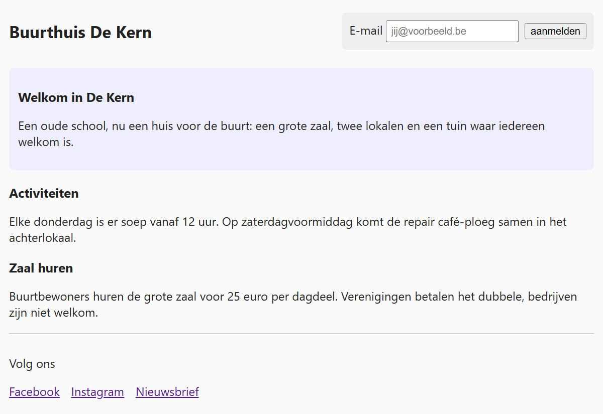

## Theorie

Een **id** is uniek: hij mag maar één keer voorkomen op een pagina. Je selecteert hem met een **hekje** ervoor.

```html
<nav id="hoofdmenu">het menu van de site</nav>
```

```css
#hoofdmenu { /* selecteert het element met id="hoofdmenu" */
   background-color: #333;
}
```

Gebruik een id voor de bouwstenen die op een pagina maar één keer bestaan: het hoofdmenu, de zoekbalk, het aanmeldformulier, de voettekst. Komt iets meermaals voor, of zou het dat ooit kunnen, gebruik dan een class.

## Opdracht

Deze pagina heeft drie unieke bouwstenen met een id: het aanmeldformulier in de header, de inleiding in de main, en het sociale menu in de footer.

1. Geef het aanmeldformulier met id `form-login` deze opmaak:
   - de velden naast elkaar met `display: flex`
   - ruimte ertussen met `gap: 8px`
   - netjes op één lijn met `align-items: center`
   - een grijze achtergrond met `background-color: #eee`
   - ruimte binnenin met `padding: 10px`
   - ronde hoeken met `border-radius: 6px`
2. Geef de inleiding met id `intro` een lichtblauwe achtergrond met `background-color: #eef`, ruimte binnenin met `padding: 12px` en ronde hoeken met `border-radius: 6px`.
3. Zet het sociale menu met id `socialmenu` naast elkaar met `display: flex` en `gap: 15px`, en haal de bolletjes en de inspringing weg met `list-style: none` en `padding: 0`.

## Screenshot


