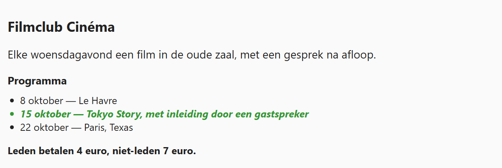

## Theorie

Een class zegt niets over het soort element: dezelfde class kan op een paragraaf, een lijstitem of een titel staan. Wil je er maar één soort van, dan plak je de **tag tegen de class**, zonder spatie ertussen. Zo een selector zonder spaties heet een **compound selector**: alle voorwaarden gelden voor hetzelfde element.

```css
.tip { /* elk element met class "tip" */
   font-weight: bold;
}

li.tip { /* enkel de lijstitems met class "tip" */
   font-style: italic;
}
```

Een `<p class="tip">` wordt door de tweede regel dus niet geraakt: die heeft de class wel, maar is geen lijstitem.

Hetzelfde werkt met een id: `section#intro` selecteert het element met dat id enkel als het een `section` is. Dat is meestal overbodig — een id is toch al uniek — maar bij een class is het vaak net wat je nodig hebt.

Let op de spatie: `li.tip` is één element, `li .tip` zou een element met class `tip` **binnen** een lijstitem selecteren. Dat laatste komt in de volgende oefening aan bod.

## Opdracht

De class `big` staat op een paragraaf én op een lijstitem, de class `tip` ook.

1. Maak alle elementen met class `tip` vet met `font-weight: bold`. Zowel de paragraaf als het lijstitem verandert mee.
2. Maak enkel het **lijstitem** met class `tip` schuin met `font-style: italic` en groen met `color: #393`. De paragraaf met dezelfde class blijft zoals ze is.
3. Maak enkel de **paragraaf** met class `big` groter met `font-size: 18px`. Het lijstitem met dezelfde class verandert niet mee.

## Screenshot


