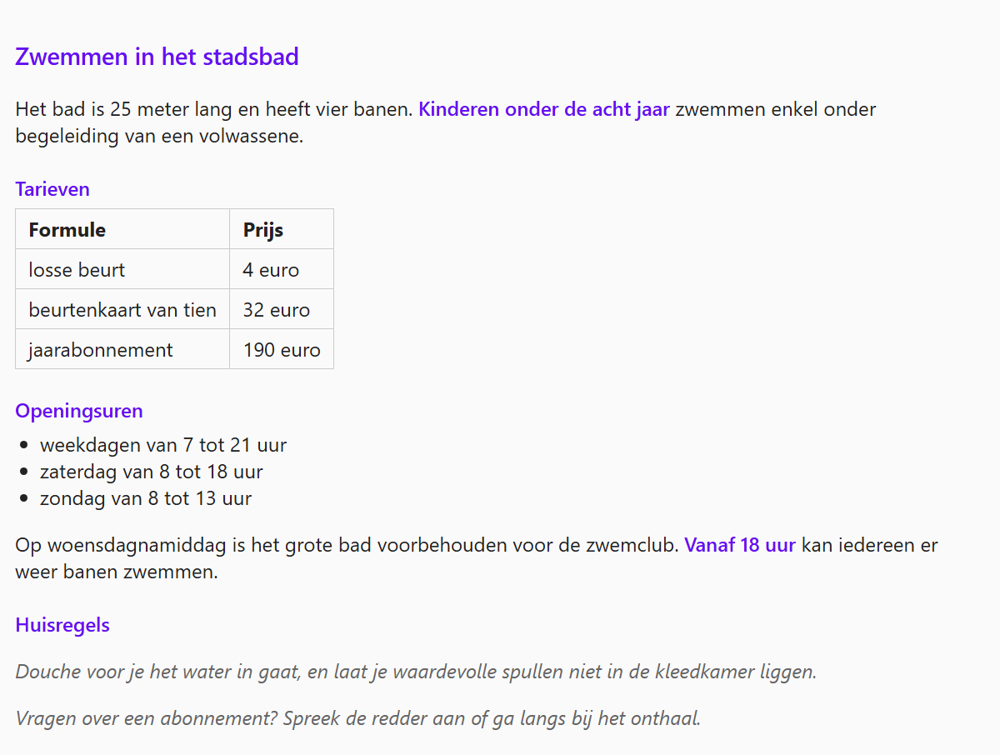

## Theorie

Moeten verschillende selectoren dezelfde stijl krijgen, dan zet je ze met een **komma** achter elkaar in plaats van de stijlregel te kopiëren. Zet elke selector op een eigen regel: dat leest een pak makkelijker.

```css
header,
footer { /* de stijlen gelden voor header én footer */
   background-color: #009;
   padding: 10px;
}
```

Je mag alle soorten selectoren door elkaar groeperen, dus ook een tag samen met een class.

## Opdracht

Pas dezelfde stijl toe op meerdere selectoren tegelijk. Schrijf elke groep als één stijlregel, niet als twee of drie losse.

1. Maak alle &lt;h3&gt;, &lt;h4&gt; en alle elementen met class `gekleurd` donkerpaars met `color: #6610f2` en wat vetter met `font-weight: 500`.
2. Geef de kop- en gewone cellen van de tabel dezelfde opmaak: een grijze rand met `border: 1px solid #ccc`, ruimte binnenin met `padding: 5px 10px` en links uitgelijnd met `text-align: left`.
3. Zet het citaat en de paragraaf met class `opmerking` schuin met `font-style: italic` en in het grijs met `color: #666`.

## Screenshot


