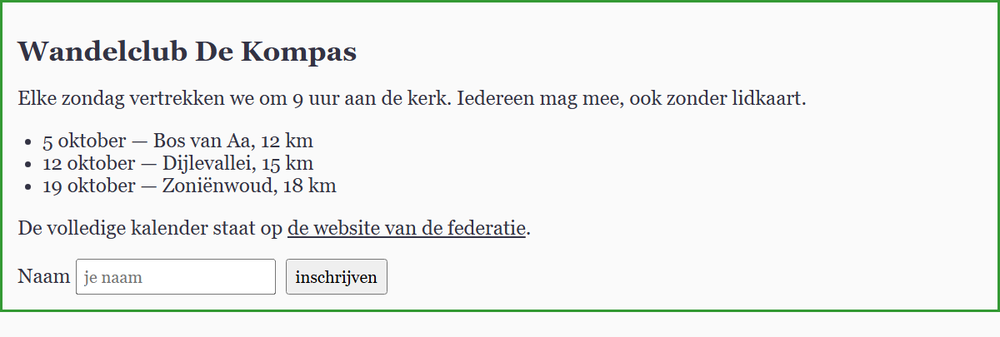

## Theorie

Een element neemt een aantal stijlen over van zijn ouder. Dat heet **overerving**, en het is de reden waarom je het lettertype van een hele pagina op de `body` zet in plaats van op elk element apart.

```css
body {
   color: #334;
   font-family: Georgia, serif;
}
```

Niet alles erft over. Grofweg:

- **wel**: alles wat met tekst te maken heeft — `color`, `font-family`, `font-size`, `font-weight`, `line-height`, `text-align`, `list-style`
- **niet**: alles wat met het kader te maken heeft — `border`, `padding`, `margin`, `background`, `width`, `height`

Dat verschil is logisch: zet je een rand rond de `body`, dan wil je niet dat elke paragraaf, elk lijstitem en elke link er ook een krijgt.

Een geërfde waarde is bovendien maar een *startwaarde*. Elementen met een eigen browserstijl overschrijven ze meteen: een link heeft zijn eigen blauw, een knop en een invoerveld hebben hun eigen lettertype. Die stijl komt van de browser zelf, en die weegt zwaarder dan wat het element erft.

Wil je zo een element tóch laten meedoen, dan vraag je de waarde van de ouder expliciet op met het sleutelwoord `inherit`:

```css
a {
   color: inherit; /* neem de kleur van de ouder over */
}
```

## Opdracht

1. Zet op de `body` het lettertype met `font-family: Georgia, serif` en de tekstkleur met `color: #334`. Kijk goed wat er wel en niet mee verandert.
2. Zet op de `body` ook een rand met `border: 2px solid #393`. Die erft niet over: hij komt enkel rond de pagina te staan, niet rond elke paragraaf.
3. De link houdt zijn eigen blauw. Laat hem de kleur van zijn omgeving overnemen met `color: inherit`.
4. Het invoerveld en de knop houden hun eigen lettertype. Laat ze dat van de pagina overnemen met `font-family: inherit`.

## Screenshot


