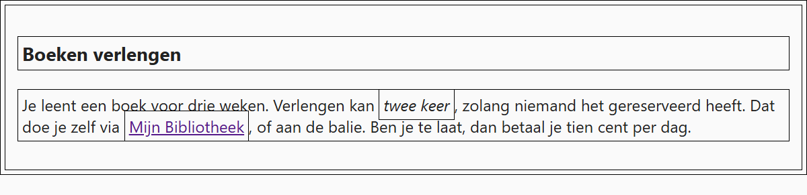

## Theorie

De universele selector `*` selecteert **alle** elementen.

```css
* { /* selecteert alles */
   margin: 0;
}
```

Hij is handig om een basis te leggen, bijvoorbeeld om marges te resetten of om overal `box-sizing: border-box` te zetten, maar gebruik hem spaarzaam: hij raakt echt élk element, en dat is zelden wat je wil.

Kan je hetzelfde bereiken met overerving, doe dat dan. Voor tekststijlen zet je de regel op de `body`: de rest van de pagina neemt ze vanzelf over, en een element dat het anders wil kan ze nog overschrijven.

```css
body { /* beter: de pagina erft het lettertype */
   font-family: Georgia, serif;
}

* { /* niet nodig, en moeilijker te overschrijven */
   font-family: Georgia, serif;
}
```

Bewaar de universele selector dus voor wat níet overerft, zoals `margin`, `padding` en `box-sizing`.

## Opdracht

Selecteer alle elementen met de universele selector. Gebruik hem spaarzaam.

1. Geef alle elementen een padding met `padding: 4px` en een 1px zwarte rand met `border: 1px solid black`.

## Screenshot


