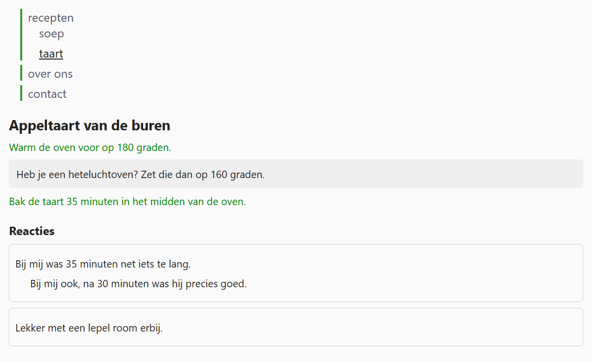

## Theorie

De descendant selector kijkt hoe diep dan ook. Wil je enkel de **rechtstreekse** kinderen van een element, dan gebruik je `>`.

```css
.box > span { /* enkel de spans die direct in .box zitten */
   padding: 5px;
}
```

`.box span` selecteert dus ook de spans die nog een niveau dieper genest zitten, `.box > span` niet.

Dat verschil telt zodra dezelfde structuur zich herhaalt: een menu met een submenu, een reactie met een antwoord eronder, een blok met een kader erin. Zonder `>` krijgt elk niveau dezelfde opmaak, en verdwijnt precies het onderscheid dat je wil tonen.

## Opdracht

Deze pagina heeft drie plaatsen waar hetzelfde soort element in zichzelf genest zit: een menu met een submenu, een blok met een kader erin, en een reactie met een antwoord.

1. Geef enkel de hoofditems van het menu een groene lijn links met `border-left: 3px solid #393` en ruimte ernaast met `padding-left: 8px`. De items van het submenu krijgen niets.
2. Maak enkel de paragrafen die direct in `.blok` staan groen met `color: #080`. De paragraaf in het kader blijft zwart.
3. Geef enkel de reacties die direct in `.reacties` staan een kader met `border: 1px solid #ccc`, ronde hoeken met `border-radius: 4px` en ruimte binnenin met `padding: 8px`. Het antwoord binnen een reactie krijgt geen eigen kader.

## Screenshot


