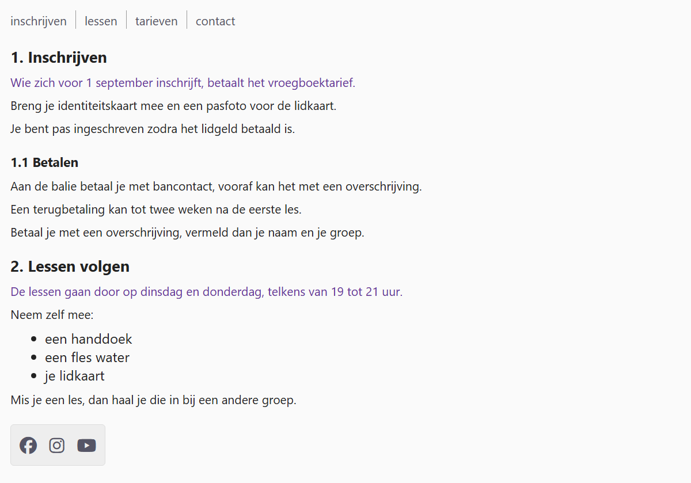

## Theorie

De **next sibling selector** `+` selecteert het element dat onmiddellijk op een ander element **volgt**, op hetzelfde niveau. Zo geef je bijvoorbeeld enkel de eerste paragraaf na een titel een afwijkende opmaak.

```css
p + ul { /* elke ul die direct op een p volgt */
   margin-top: 10px;
}
```

Staat er nog iets tussen de twee elementen, dan selecteert `+` niets meer.

Een klassieke toepassing is ruimte of een scheidingslijn tussen items die naast elkaar staan. Je zet die niet op elk item — dan staat er ook een vóór het eerste — maar enkel op een item dat op een ander item volgt.

## Opdracht

Selecteer het element dat onmiddellijk op een ander element volgt.

1. Maak de paragrafen die onmiddellijk op een &lt;h3&gt; volgen paars met `color: #639`.
2. Geef in het blokje met sociale media alle links behalve de eerste een linkermarge met `margin-left: 10px`.
3. Zet in het menu bovenaan een scheidingslijn tussen de items, met `border-left: 1px solid #999`, en ruimte aan beide kanten van die lijn met `margin-left: 10px` en `padding-left: 10px`. Vóór het eerste item mag er geen lijn staan.
   - tip: selecteer een menu-item dat op een menu-item volgt
   - tip: de opsomming middenin de tekst mag geen lijntjes krijgen, dus je selector moet ook zeggen *waar* die items staan

## Screenshot


