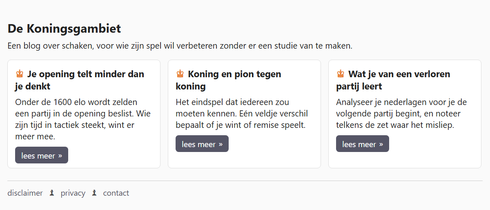

## Theorie

Een **pseudo element** is een stukje dat niet in de HTML staat, maar dat je met CSS toevoegt. Met `::before` en `::after` zet je inhoud vóór of na een element. Ze werken enkel in combinatie met de property `content`. Let op de dubbele dubbelpunt.

```css
li::before {
   color: #007;
   content: "→";
   margin-right: 5px; /* voorzie wat tussenruimte */
}
```

Gebruik dit voor inhoud die tot het **design** hoort, zoals een pijltje, een bulletje of een icoon. Echte inhoud hoort in de HTML thuis.

Je kan het pseudo-element ook combineren met de selectoren die je al kent. `li + li::before` zet iets vóór elk lijstitem dat op een ander lijstitem volgt — dus overal behalve vóór het eerste.

## Opdracht

Voeg met CSS inhoud toe aan het begin of het einde van elementen.

1. Zet vóór de titel van elke card de tekst "♔", in het oranje met `color: #e87722` en met een rechtermarge van `margin-right: 5px`.
2. Zet achter elke "lees meer"-knop de tekst "»", met een linkermarge van `margin-left: 5px`.
3. Zet in het menu van de footer een "♟" tússen de items, met ruimte links en rechts via `margin: 0 8px`. Vóór het eerste item mag er geen pion staan.
   - tip: lees goed de theorie hierboven

## Screenshot


