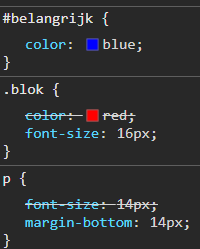
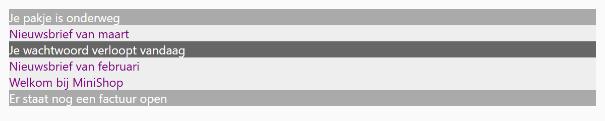

## Theorie

Als twee stijlregels hetzelfde element opmaken, moet de browser kiezen. Dat gebeurt op basis van **specificiteit**: hoe preciezer de selector, hoe zwaarder hij weegt. De volgorde is **id > class > tag**. Enkel bij een gelijke specificiteit wint de regel die het laatst in de stylesheet staat.

```css
#belangrijk {
   color: blue; /* wint: een id weegt zwaarder dan een class */
}

.blok {
   color: red; /* verliest van #belangrijk */
   font-size: 16px; /* wint: een class weegt zwaarder dan een tag */
}

p {
   font-size: 14px; /* verliest van .blok */
   margin-bottom: 14px; /* geen conflict, wordt gewoon toegepast */
}
```

De strijd wordt per **property** beslecht, niet per stijlregel. In de inspector zie je de verliezende properties doorstreept:



Bij langere selectoren kan je de specificiteit **berekenen**. Tel hoeveel id's, classes en tags er in de selector staan, en zet die drie getallen naast elkaar:

```css
#menu a.active { /* 1 id, 1 class, 1 tag  →  1-1-1 */
   color: red;
}

nav ul li a { /* 0 id's, 0 classes, 4 tags  →  0-0-4 */
   color: blue;
}
```

Je vergelijkt die getallen van links naar rechts, je telt ze niet op: `1-1-1` wint van `0-0-4`, want één id weegt zwaarder dan om het even hoeveel tags. Meer uitleg en oefeningen vind je op [de cursuspagina over specificiteit berekenen](https://rogiervdl.github.io/CSS-course/01_syntax.html#specificiteit-berekenen).

## Opdracht

Voeg de regels één voor één toe in de opgegeven volgorde. Kijk na elke stap wat er wel of niet verandert, en probeer te begrijpen waarom.

1. Geef de elementen met class `specifiek` een middelgrijze achtergrond met `background-color: #aaa`.
2. Geef dan het element met id `uniek` een donkere achtergrond met `background-color: #666`.
3. Geef de `div` elementen een lichte achtergrond met `background-color: #eee`.
4. Geef de elementen met class `specifiek` een witte tekstkleur met `color: white`.
5. Geef de `div` elementen een paarse kleur met `color: #800080`.

## Screenshot


